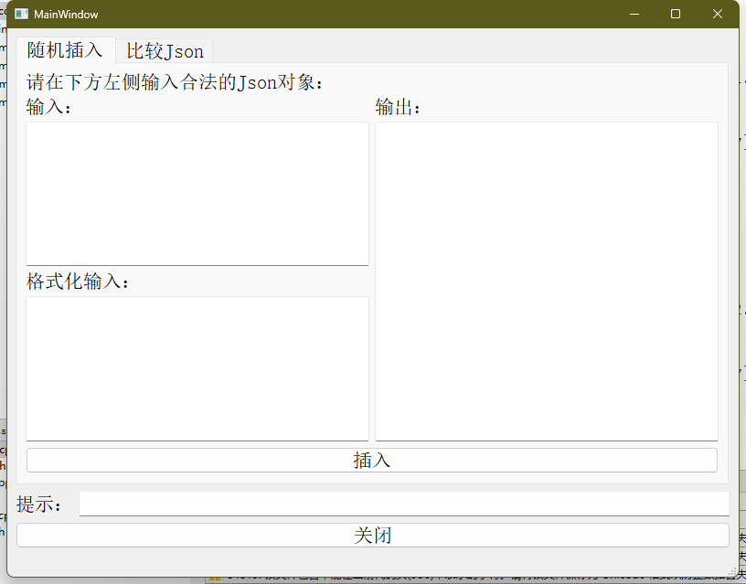
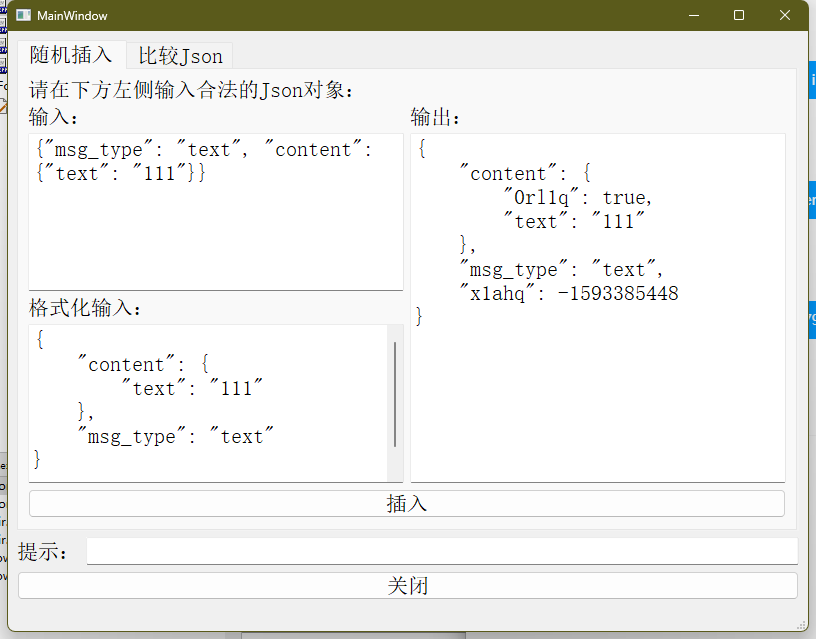
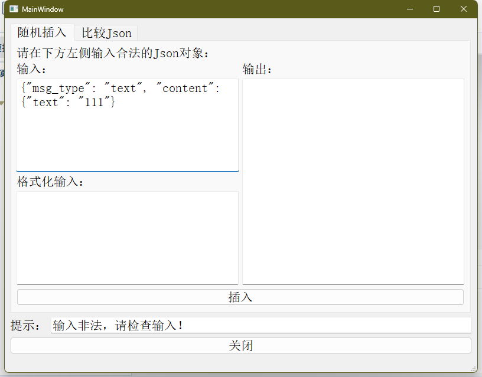
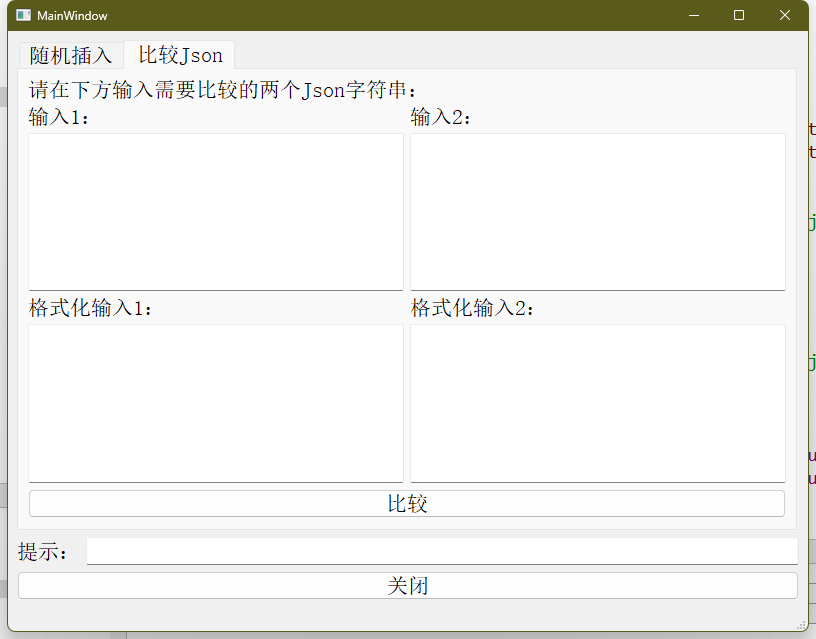
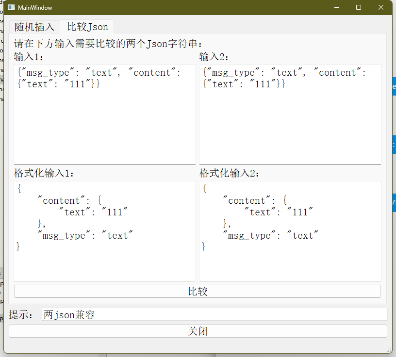
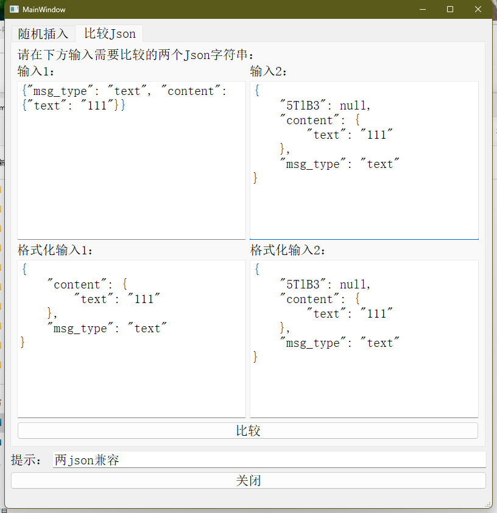
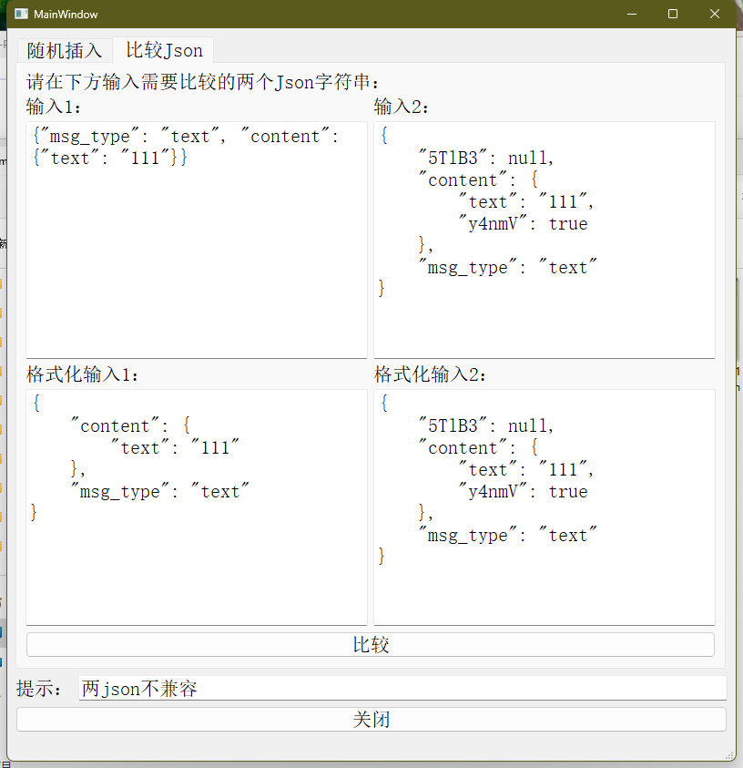
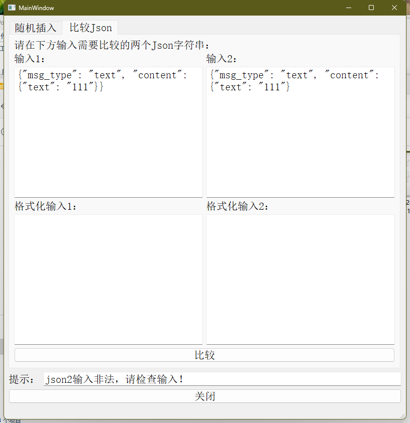

# jsonTool

## 随机插入

### 使用说明



可在左上方输入框输入待插入的字符串，如：

```json
{"msg_type": "text", "content": {"text": "111"}}
```

点击插入：



左下方会将未格式化的Json对象格式化后输出，右侧会输出在源Json每一个层级下都插入一个合法键值对后的结果。

### 错误类型

若输入非法Json对象：

```json
{"msg_type": "text", "content": {"text": "111"}
```

工具会提示输入非法，并清空格式化输入和输出框：



## 比较Json

### 使用说明



可以在输入1和输入2框内分别输入待比较的字符串：

- 兼容情况，两边都输入下面的Json对象：

    ```json
    {"msg_type": "text", "content": {"text": "111"}}
    ```

    工具输出为：

    

- 兼容情况：

    输入1输入：

    ```json
    {"msg_type": "text", "content": {"text": "111"}}
    ```

    输入2输入：

    ```json
    {
        "5TlB3": null,
        "content": {
            "text": "111"
        },
        "msg_type": "text"
    }
    ```

    工具输出为：

    

- 不兼容的情况：

    输入1输入：

    ```json
    {"msg_type": "text", "content": {"text": "111"}}
    ```

    输入2输入：

    ```json
    {
        "5TlB3": null,
        "content": {
            "text": "111",
            "y4nmV": true
        },
        "msg_type": "text"
    }
    ```

    工具输出为：

    

### 错误类型

若在输入1或者输入2输入非法Json对象：

```json
{"msg_type": "text", "content": {"text": "111"}
```

会提示输入非法：



